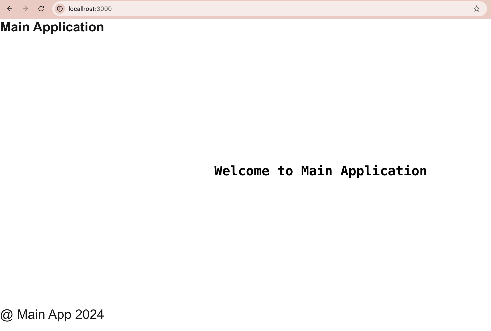
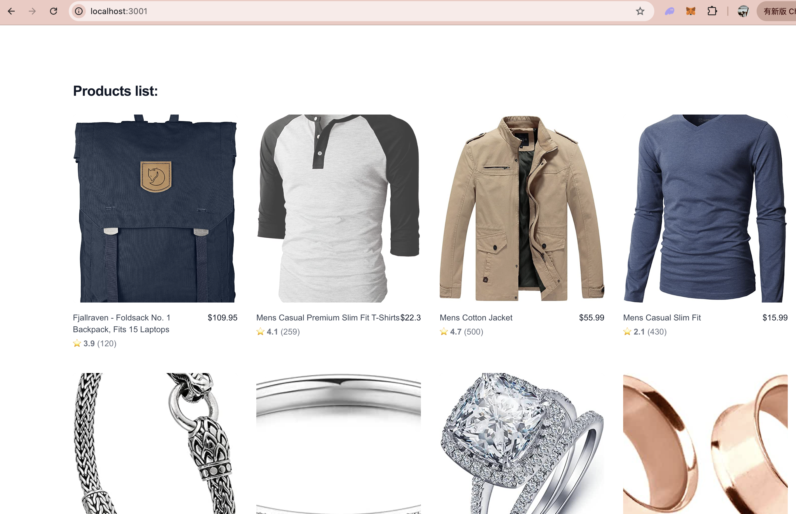
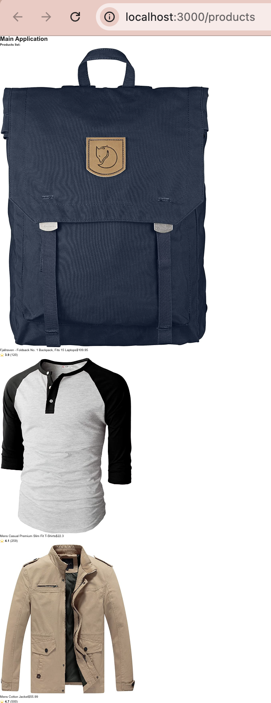
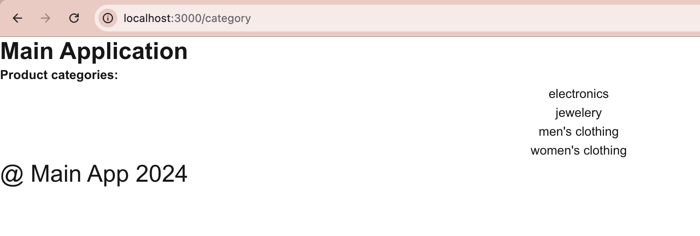
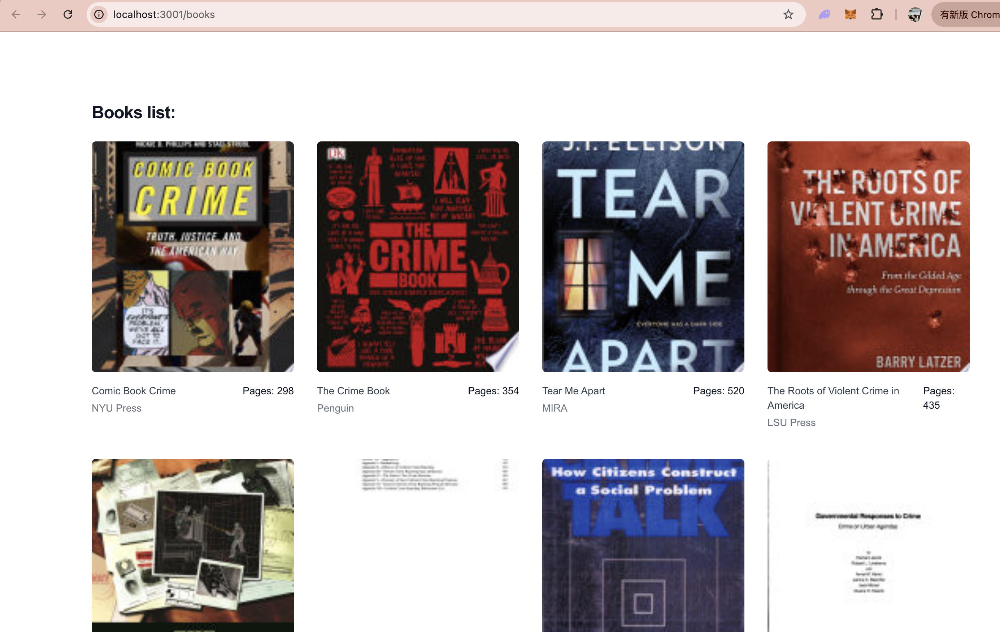
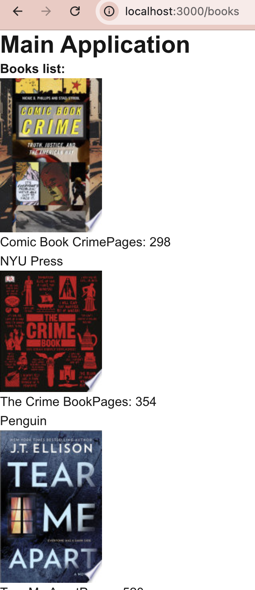

<<<<<<< HEAD
# Building-Next.js-Micro-Frontend-App-PoC-with-Module-Federation
=======
# Building Next.js Micro Frontend App PoC with Module Federation
## 1.	Introduction
Module Federation is a new feature introduced in Webpack 5, designed to address module sharing and dynamic loading in micro frontend architectures. It allows multiple independent JavaScript applications to share code and modules without needing to recompile the entire application.

Host and Remote: In Module Federation, an application can act as a Host (main application) or a Remote (remote application). The Host can load modules or components from the Remote application, while the Remote exposes its own modules for other applications to use.
## 2.	Project setups
### a.	Creating a root directory and three subdirectories for the main application and one micro frontend application.

```
mkdir nextjs-mf-apps
cd nextjs-mf-apps
```

### b. Create the Main Application

```
npx create-next-app@14.2 main-app
```

**Super important!**

After initializing the project setup, Next.js will present several options. You can choose the options that fit your requirements, but make sure to avoid selecting "Would you like to use App Router? (recommended)."


In the latest versions of Next.js, a new feature called App Router is introduced for improved folder-based routing. However, this version does not support "Micro frontend" functionality when the App Router feature is enabled. Therefore, if you need Micro frontend support, please choose NO for the App Router option.

### c. Create Micro Frontend App
```
npx create-next-app@14.2 shop-app
```

So, the project structure would be

```
/nextjs-mf-apps
  /main-app
  /shop-app
```

## 3. Installing required packages

Run the below commands in both the apps “main-app” and “shop-app”.

```
npm i @module-federation/nextjs-mf webpack
```

Once installing the packages in both the apps, go to package.json file and add NEXT_PRIVATE_LOCAL_WEBPACK=true to the dev command in the script section in both the apps as below.

```
"scripts": {
    "dev": "NEXT_PRIVATE_LOCAL_WEBPACK=true next dev",
    "build": "next build",
    "start": "next start",
    "lint": "next lint"
  },
```

## 4. Setting Up the Micro Frontend Configuration

Add the below configuration code to next.config.mjs file to use the NextFederationPlugin in Main App.

```js
import NextFederationPlugin from '@module-federation/nextjs-mf';

export const nextConfig = {
  webpack(config, options) {
    const { isServer } = options;
    config.plugins.push(
      new NextFederationPlugin({
        name: 'main_app',
        remotes: {
        },
        filename: 'static/chunks/remoteEntry.js',
        exposes: {},
        extraOptions: {
          debug: false,
          exposePages: false,
        },
        shared: {},
      })
    );

    return config;
  },
};

export default nextConfig;
```

Next, add the same configuration code in Shop app as well and update the name property to shop_app as below.

```js
import NextFederationPlugin from '@module-federation/nextjs-mf';

export const nextConfig = {
  webpack(config, options) {
    const { isServer } = options;
    config.plugins.push(
      new NextFederationPlugin({
        name: 'shop_app',
        remotes: {},
        filename: 'static/chunks/remoteEntry.js',
        exposes: {},
        extraOptions: {
          debug: false, // `false` by default
          exposePages: false, // `false` by default
        },
        shared: {},
      })
    );

    return config;
  },
};

export default nextConfig;
```

As we are going to run two apps simultaneously, we can assign specific port to our Shop app as below in package.json file.

```json
"scripts": {
    "dev": "NEXT_PRIVATE_LOCAL_WEBPACK=true next dev -p 3001",
    "build": "next build",
    "start": "next start",
    "lint": "next lint"
  },
```

Now go to index.js file of main-app project and replace with the below code.

```js
export default function Home() {
  return (
    <main className='h-[100vh] flex justify-center items-center'>
      Hello main app
    </main>
  );
}
```

Next go to index.js file of shop-app project and replace with the below code.

```js
export default function Home() {
  return (
    <main className='h-[100vh] flex justify-center items-center'>
      Hello shop app
    </main>
  );
}
```

Once doing all this basic changes run both the apps with the below command.

```
npm run dev
```


## 5. Creating Components into the Main Application

Now create folder components in the root directory of main-app and create two components Navbar.js and Footer.js and paste the code below to the respective files.

Navbar.js
```js
import React from 'react';

export default function Navbar() {
  return (
    <nav className='bg-red-500 flex h-[15vh]'>
      <div className='text-3xl font-bold flex items-center p-5 text-white'>
        Main Application
      </div>
    </nav>
  );
}
```

Footer.js
```js
import React from 'react';

export default function Footer() {
  return (
    <div className='flex h-[10vh] bg-blue-500'>
      <div className='text-3xl font-light flex w-[100%] items-center justify-center p-5 text-white'>
        @ Main App {new Date().getFullYear()}
      </div>
    </div>
  );
}
```

Now import these two components into the index.js file as below.

```js
import Footer from '@/components/Footer';
import Navbar from '@/components/Navbar';

export default function Home() {
  return (
    <main className='flex flex-col bg-white'>
      <Navbar />
      <div className='h-[75vh] py-4'>
        <h1 className='text-3xl font-bold font-mono h-[100%] flex justify-center items-center text-black'>
          Welcome to Main Application
        </h1>
      </div>
      <Footer />
    </main>
  );
}
```



## 6. Creating Components into the Shop Application

Just like in our main application, we'll be adding a Products component to our Shop app. Start by creating a folder named components in the root directory of main-app, then create a file called Products.js inside it and paste the code provided below.


```js
import React, { useEffect, useState } from 'react';

export default function Products() {
  const [data, setData] = useState([]);
  async function getData() {
    fetch('https://fakestoreapi.com/products')
      .then((res) => res.json())
      .then((res) => {
        setData(res);
      });
  }
  useEffect(() => {
    getData();
  }, []);
  return (
    <div className='bg-white'>
      <div className='mx-auto max-w-2xl px-4 py-16 sm:px-6 sm:py-24 lg:max-w-7xl lg:px-8'>
        <h2 className='text-2xl font-bold tracking-tight text-gray-900'>
          Products list:
        </h2>
        <div className='mt-6 grid grid-cols-1 gap-x-4 gap-y-10 sm:grid-cols-2 lg:grid-cols-4 xl:gap-x-8'>
          {data.map((product) => (
            <div className='group relative' key={product.id}>
              <div className='aspect-h-1 aspect-w-1 w-full overflow-hidden rounded-md bg-gray-200 lg:aspect-none group-hover:opacity-75 lg:h-80'>
                
              </div>
              <div className='mt-4 flex justify-between'>
                <div>
                  <h3 className='text-sm text-gray-700'>
                    <a>
                      <span
                        aria-hidden='true'
                        className='absolute inset-0'
                      ></span>
                      {product.title}
                    </a>
                  </h3>
                  <p className='mt-1 text-sm text-gray-500'>
                    <span className='font-medium'>⭐</span>{' '}
                    <span className='font-bold'>{product.rating.rate}</span> (
                    {product.rating.count})
                  </p>
                </div>
                <p className='text-sm font-medium text-gray-900'>
                  ${product.price}
                </p>
              </div>
            </div>
          ))}
        </div>
      </div>
    </div>
  );
}
```

In this component, we use a free API to display some products on our page.

Next, import the Products component into index.js of the app and paste the code provided below.

```js
import Products from '@/components/Products';

export default function Home() {
  return (
      <Products />
  );
}
```



## 7. Integrating the Shop Application into Main Application

Next, we'll add the shareable components to the expose object within the NextFederationPlugin in the Shop app. 

Update the next.config.mjs file with the code provided below.

```js
exposes: {
  './Products': './components/Products.js',
},
```

Update the Main App’s next.config.mjs file with the below code.

```js
remotes: {
  shop_app: `shop_app@http://localhost:3001/_next/static/${
    isServer ? 'ssr' : 'chunks'
  }/remoteEntry.js`,
},
```

After configuring the Shop app in the Main app, we will display the Products component on a new page called products. To do this, create a folder named products inside the pages folder of the Main app. Then, create an index.js file inside the products folder.

We'll use the dynamic utility to import the Products component from the Shop app into the products page, as shown below.

```js
import dynamic from 'next/dynamic';

const ProductsList = dynamic(() => import('cart/Products'), {
  loading: () => <p>Loading...</p>,
});
```

To enhance the appearance, we will add Navbar and Footer components to the page. The final code for the products/index.js file will look like the following.


```js
import React from 'react';
import dynamic from 'next/dynamic';
import Navbar from '@/components/Navbar';
import Footer from '@/components/Footer';

const ProductsList = dynamic(() => import('shop_app/Products'), {
  loading: () => <p>Loading...</p>,
});

export default function index() {
  return (
    <main className='flex flex-col bg-white'>
      <Navbar />
      <ProductsList />
      <Footer />
    </main>
  );
}
```


Once adding this code, navigate to the route http://localhost:3000/products , No you will see the below error saying react-hydration-error


## 8. Fixing Hydration Error

To fix this error you have to set ssr: false while importing the Micro frontend App’s components as shown below.

```js
import React from 'react';
import dynamic from 'next/dynamic';
import Navbar from '@/components/Navbar';
import Footer from '@/components/Footer';

const ProductsList = dynamic(() => import('shop_app/Products'), {
  loading: () => <p>Loading...</p>,
  ssr: false,
});

export default function index() {
  return (
    <main className='flex flex-col bg-white'>
      <Navbar />
      <ProductsList />
      <Footer />
    </main>
  );
}
```



### 9. Share pages from the micro frontend app to the main app.

For this now go to the Shop app and create a folder category inside the pages folder and create a index.js file inside and paste the code below.

```js
import React, { useState, useEffect } from 'react';

export default function page() {
  const [data, setData] = useState([]);
  async function getData() {
    fetch('https://fakestoreapi.com/products/categories')
      .then((res) => res.json())
      .then((res) => {
        setData(res);
        console.log(res);
      });
  }
  useEffect(() => {
    getData();
  }, []);
  return (
    <div className='bg-white h-[100vh]'>
      <div className='mx-auto max-w-2xl px-4 py-16 sm:px-6 sm:py-24 lg:max-w-7xl lg:px-8'>
        <h2 className='text-2xl font-bold tracking-tight text-gray-900'>
          Product categories:
        </h2>
        <div className='mt-6 grid grid-cols-1 gap-x-4 gap-y-10 sm:grid-cols-2 lg:grid-cols-4 xl:gap-x-8'>
          {data.map((cat) => (
            <h3
              key={cat}
              className='mt-4 text-gray-800 flex justify-center border-2 border-red-950 w-[100%]'
            >
              {cat}
            </h3>
          ))}
        </div>
      </div>
    </div>
  );
}
```

Now to validate the changes visit http://localhost:3001/category the output looks like below.


Now we can expose the page in next.config.mjs file similarly, how we exposed the components as below.

```js
 exposes: {
          './Products': './components/Products.js',
          './category': './pages/category/index.js',
        },
```

Now go to the pages folder and create a category.js file inside and paste the code below.

```js
import React from 'react';
import dynamic from 'next/dynamic';
import Navbar from '@/components/Navbar';
import Footer from '@/components/Footer';

const ProductsCategory = dynamic(() => import('shop_app/category'), {
  loading: () => <p>Loading...</p>,
  ssr: false,
});

export default function index() {
  return (
    <main className='flex flex-col bg-white'>
      <Navbar />
      <ProductsCategory />
      <Footer />
    </main>
  );
}
```



### 10. Creating Books with index.js

Now we create another page books in the Shop App. Create a folder books with index.js file inside in pages folder and paste the below code.

```js
import React from 'react';

function Page({ books }) {
  return (
    <div className='bg-white'>
      <div className='mx-auto max-w-2xl px-4 py-16 sm:px-6 sm:py-24 lg:max-w-7xl lg:px-8'>
        <h2 className='text-2xl font-bold tracking-tight text-gray-900'>
          Books list:
        </h2>
        <div className='mt-6 grid grid-cols-1 gap-x-4 gap-y-10 sm:grid-cols-2 lg:grid-cols-4 xl:gap-x-8'>
          {books.map((book) => (
            <div className='group relative' key={book.id}>
              <div className='aspect-h-1 aspect-w-1 w-full overflow-hidden rounded-md bg-gray-200 lg:aspect-none group-hover:opacity-75 lg:h-80'>
                
              </div>
              <div className='mt-4 flex justify-between'>
                <div>
                  <h3 className='text-sm text-gray-700'>
                    <a>
                      <span
                        aria-hidden='true'
                        className='absolute inset-0'
                      ></span>
                      {book?.volumeInfo?.title}
                    </a>
                  </h3>
                  <p className='mt-1 text-sm text-gray-500'>
                    {book?.volumeInfo?.publisher}
                  </p>
                </div>
                <p className='text-sm font-medium text-gray-900'>
                  Pages: {book?.volumeInfo?.pageCount}
                </p>
              </div>
            </div>
          ))}
        </div>
      </div>
    </div>
  );
}

Page.getInitialProps = async (ctx) => {
  const books = await fetch(
    'https://www.googleapis.com/books/v1/volumes?q=crime'
  ).then((res) => res.json());

  return {
    books: books.items ?? [],
  };
};

export default Page;
```

Now to validate the changes visit http://localhost:3001/books the output looks like below.


Now we can expose the books page in next.config.mjs file a similar way, how we exposed the category as below.

```js
 exposes: {
          './Products': './components/Products.js',
          './category': './pages/category/index.js',
          './books': './pages/books/index.js',
        },
```


After exposing this in Shop App, now go to main App. Now go to the main app pages folder and create a books.js file inside and paste the code below.

```js
import React from 'react';
import dynamic from 'next/dynamic';
import Navbar from '@/components/Navbar';
import Footer from '@/components/Footer';

const Books = dynamic(() => import('shop_app/books'), {
  loading: () => <p>Loading...</p>,
  ssr: false,
});

function Page() {
  return (
    <main className='flex flex-col bg-white'>
      <Navbar />
      <Books />
      <Footer />
    </main>
  );
}

export default Page;
```

After this, You will see the blank black broken screen. You can find an error in the console saying “TypeError: Cannot read properties of undefined (reading ‘map’)”


We can send the data as a props from the Main App. Update the books.js file as shown below.

```js
import React from 'react';
import dynamic from 'next/dynamic';
import Navbar from '@/components/Navbar';
import Footer from '@/components/Footer';

const Books = dynamic(() => import('shop_app/books'), {
  loading: () => <p>Loading...</p>,
  ssr: false,
});

function Page({ books }) {
  return (
    <main className='flex flex-col bg-white'>
      <Navbar />
      <Books books={books} />
      <Footer />
    </main>
  );
}

Page.getInitialProps = async (ctx) => {
  const books = await fetch(
    'https://www.googleapis.com/books/v1/volumes?q=crime'
  ).then((res) => res.json());

  return {
    books: books.items ?? [],
  };
};

export default Page;
```



>>>>>>> f1dff51 (Initial commit)
